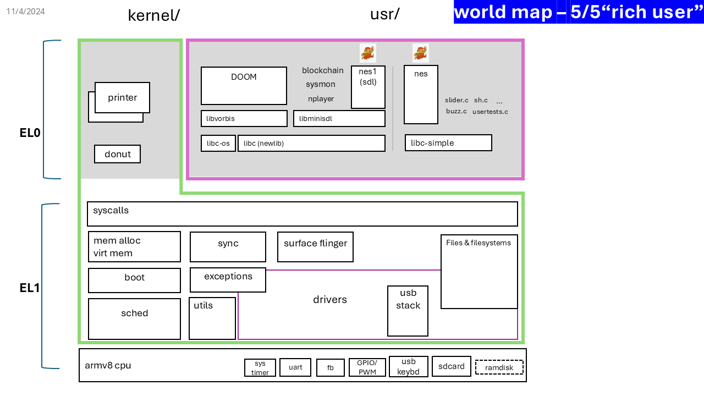

# UVA-OS Lab5 "Rice User" 

This is the last part of the UVA-OS class (CS4414/CS6456). 

[OVERVIEW](https://github.com/fxlin/cs4414-main) |
[LAB1](https://github.com/fxlin/uva-os-world1) |
[LAB2](https://github.com/fxlin/uva-os-world2) |
[LAB3](https://github.com/fxlin/uva-os-world3) |
[LAB4](https://github.com/fxlin/uva-os-world4) |
[LAB5](https://github.com/fxlin/uva-os-world5) 

Students: see [quests-lab5.md](quests-lab5.md)

## GALLERY

https://github.com/user-attachments/assets/3d7bdf38-25d8-46dc-9f1a-8e0624e0c78f


https://github.com/user-attachments/assets/991ec275-7620-42ec-bb9c-39762b5ad080


## DESIGNS

The OS now includes a full libc (`newlib`) and miniature libSDL (for abstracting input/output events), 
atop which we port additional applications, including a music player, a blockchain miner, and DOOM (1993, [itrunsdoom](https://www.reddit.com/r/itrunsdoom/)). 
To enable easy file exchanges between our OS and PC/Mac machines, we also 
bring up the SD card driver and port FAT32 filesystem support.
We implement a desktop environment, comprising a simple window manager and an input dispatcher;
as such multiple apps can be rendered on the screen concurrently.
Eventually, we bring up all four CPU cores to unleash full power of the Raspberry Pi 3.



This OS introduces virtual memory and user/kernel separation. It provides syscalls and can run one or multiple "Mario" applications concurrently in userspace.

✅ More syscalls: thread related (clone/semaphore) 

✅ libc (newlib)

✅ SDL 

✅ SD card

✅ FAT32

✅ DOOM

✅ Desktop

✅ Multicore

✅ Waveshare Raspberry Pi GAMEHAT

## QUICKSTART

### For rpi3 (QEMU)

```
export PLAT=rpi3qemu
```

| Action                      | Command                   |
|-----------------------------|---------------------------|
| To clean up                 | `./cleanall.sh`           |
| To build everything         | `./makeall.sh`            |
| To run on qemu              | `./run-rpi3qemu.sh`       |
| Launch qemu for debugging   | `./dbg-rpi3qemu.sh`       |

### For rpi3 (hardware)
```
export PLAT=rpi3
```

| Action              | Command             |
|---------------------|---------------------|
| To clean up         | `./cleanall.sh`     |
| To build everything | `./makeall.sh`      |

(One time): Prepare the SD card

https://github.com/fxlin/uva-os-main/tree/main/make-sd

<!-- (One time): get a blank SD card, burn the provided image with Win32DiskImager, 
balenaEtcher, or Raspberry Pi Imager.  -->

Copy the kernel image `kernel8.img` to the partition named `bootfs` and boot. 