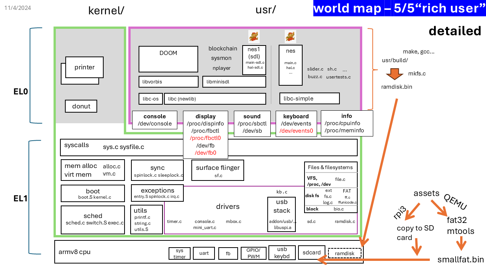
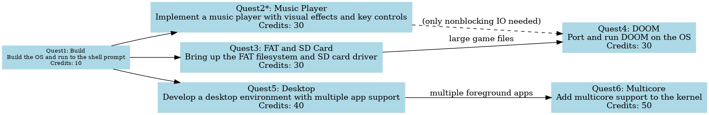
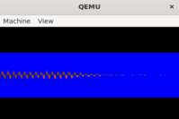
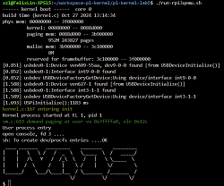
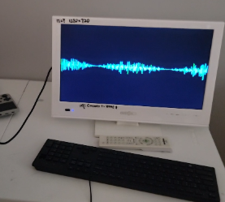
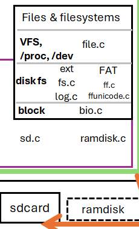
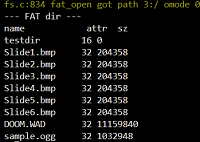
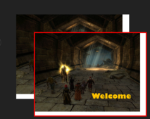

# Quests of Kernel Lab5 "Rich User"

Total estimated time: XXX hours

ℹ️ **On code navigation**

In this lab, the codebase is much more complex than in previous labs. 
To avoid getting lost, consider the following:
1. Use VS Code, especially its code navigation features and plugins: `Bookmarks`, `TODOs`, etc.
2. Refer to the "worldmap" diagram below. 

❗**On code building**
- Use ``./cleanuser.sh && ./makeall.sh`` to force rebuilding, every time you change the user code. 

- Occasionally build of `nes' may fail (reference output [here](nes-build-fail.txt)).
If you encounter this, just do build again (`./makeall.sh`).




| Quest | Short Description | Credits |
|-------|-------------------|---------|
| 🗺️ Quest1: build | Build the OS and run to the shell prompt | 10 |
| 🗺️ Quest2*: music player | Implement a music player with visual effects and key controls | 30 |
| 🗺️ Quest3: FAT and sdcard | Bring up the FAT filesystem and SD card driver | 30 |
| 🗺️ Quest4: DOOM | Port and run DOOM on the OS | 30 |
| 🗺️ Quest5: Desktop | Develop a desktop environment with multiple app support | 40 |
| 🗺️ Quest6: Multicore | Add multicore support to the kernel | 50 |

*=rpi3 only; cannot be done on QEMU

<!-- #### Total credits: 190 -->
Credits exceeding 100 will be considered as bonus.



#### Sample implementation plans
- "Jukebox" (total 70): build->music player->FAT.  A music player that play your favorite music from the sdcard.
- "DOOM console" (70): build->FAT->DOOM. A console that runs DOOM.
- "Multi marios" (100): build->Desktop->Multicore. Run multiple instances of mario side by side, on multiple cores.
- "Multi DOOMs" (130): build->DOOM->Desktop->Multicore. Run multiple instances of DOOM side by side.
- "Everything" (190): build->music player->FAT->DOOM->Desktop->Multicore. All above. 

## 🗺️ Quest1: build
**OBJECTIVE**: Build the whole OS and run to the shell prompt -- on either QEMU or rpi3 hardware.

### Get the code

Fetch the lab code and the libc code (this particular libc implementation is called `newlib`).

The code layout should look like:

```
(home)
    +--- newlib
    +--- uva-os-world5
```

Assume we will place all our code directly under `$HOME`:

```
cd 
git clone git@github.com:fxlin/uva-os-newlib.git newlib
git clone git@github.com:fxlin/uva-os-world5.git
```

Download the disk image `smallfat.bin`, and put it under `uva-os-world5/`.

https://virginia.app.box.com/folder/303726824749?s=nvduzmsulhcixdjvsgc3a9oierbllzmo

<!--  -->

### Build libc (newlib)

See [newlib/README](https://github.com/fxlin/uva-os-newlib/blob/main/README)
for instructions.
This only has to be done once. Sample build log is [here](newlib-build-log.txt).

### Build the OS

This has to be done every time you make changes to the OS code. As before:

```
cd uva-os-world5
./makeall.sh
```

No code changes are needed. The OS should boot to the shell prompt.

😙 DELIVERABLE: take a photo of the shell prompt. Reference below.



## 🗺️ Quest2: music player (rpi3 ONLY)
**NOTE**. 
The sound playback part (sub-quest 1) requires rpi3 hardware; 
the visual effect part (sub-quest 2) can be tested on both rpi3 and QEMU.

### OVERVIEW

A music player, called "nplayer", that plays .ogg files and renders the visual effect on display.

The player uses multiple threads to load sound buffer and render the visual effect.

- Grasp the idea of the nplayer source (`usr/nplayer`)
    - `usr/nplayer/Makefile` for its library dependencies
    - `usr/nplayer/nplayer.c` for its main logic. 

> The two sub-quests below can be done in parallel.

### SUB-QUEST 1: sound effect (can be tested only on rpi3)

#### Step 1.1 Bring up threading (this step can be tested on QEMU)

- Read `clonetest()` in `usr/usertests.c` to understand how it allocates stacks for new threads. If you encounter threading bugs later, revisit this step to verify your understanding.

- Complete the `clone()` path: 
    - User side: `usr/libc-simple/usys.S`
    - Kernel side: `sys_call_table` -> `sys_clone()` -> `copy_process()`.
    In `copy_process()`, complete the brach that handles `PF_UTHREAD` (for forking a user thread). 

    Pay attention to how the stack for a new thread is passed down to `copy_process()` in the kernel. This syscall path involves intricate stack handling.

- Test. From shell, run `usertests clonetest` and pass the test. Sample output is [here](usertests-clone-out.txt).

- Debugging tips. If you see error message in which ELR and FAR do not make sense at all: 
```
irq.c:218 Unhandled EL0 sync exception, cpu0, esr: 0x0000000082000004, elr: 0x910003fda9bb7bfd, far: 0x910003fda9bb7bfd
irq.c:220 online esr decoder: https://esr.arm64.dev/#0x0000000082000004
```
A common reason is a bad user stack (or SP). 
To check if they are good, you can stop GDB at `clone()` in user code, and inspect if SP is good for the child task upon syscall return. 


**CHECKPOINT** (not a DELIVERABLE): take a screenshot of the shell showing the test passed. 

- Port the user stub code (`clone()`) from  `usr/libc-simple/usys.S` to `usr/libc-os/usys.S` which will be used by nplayer. 

- Explanation: `libc-simple` is a simplified C library used by basic applications like `usertests`. In contrast, `libc-os` and `newlib` are more comprehensive and are used together by more complex applications like `nplayer`.

#### Step 1.2 Sound playback

The SDL library (Simple DirectMedia Layer) code is located in `usr/libminisdl/`.

- Understand the structure of the SDL source code, starting from its Makefile.
- Review `sdl-audio.h` to grasp the audio-related definitions and functions.
- In `audio.c`, complete the `clone()` call to create a worker thread with a proper stack. Implement `thread_func()` to refill the sound buffer via `/dev/sb`.
- In `nplayer/nplayer.c`, complete `FillAudio()` to handle the actual sound buffer filling.
- In `nplayer.c`, complete the `main()` function to load a music file (in ogg format).
- Compile `nplayer` with `HAS_VISUAL=0` (defined in the same source file)

#### Step 1.3 Get a sample music file

- Download a sample .ogg file (`sample-10s.ogg`) from here: 
https://virginia.app.box.com/folder/303726824749?s=nvduzmsulhcixdjvsgc3a9oierbllzmo
The audio only lasts 10 seconds, and is small enough (~100KB) to be included in the rootfs (ramdisk).

- Place the file under `usr/build/`

- Do `./cleanuser.sh` and `./makeall.sh` to force rebuilding the userspace. 

- After rebooting the device, make sure `ls` can list the ogg file.

**CHECKPOINT**:  run nplayer with the sample ogg and verify that sound is played. Sample command line output is [here](nplayer-sound-out.txt).

### SUB-QUEST 2: UI (can be tested on both rpi3 and QEMU)

#### Step 2.1 Visual effect 
- Complete key SDL graphics APIs in `usr/libminisdl/video.c` for drawing the graphics: `setpixel()`, `SDL_RenderClear()`, and `SDL_RenderDrawLine()`.

- In `nplayer.c`:
    - Understand the `visualeffect()` function, which renders graphics on the screen.
    - Add lock to `visualeffect()` to protect the shared sound samples passed in (`stream`).
    - In `FillAudio()`, add code to create a copy of the current sound samples (`stream`). The copy action should be protected by the lock. 
    - In the main loop of `main()`, add a call to `visualeffect()`, passing the copy of the sound samples to the visual effect rendering.
    - Don't forget set `#define HAS_VISUAL 1`

**CHECKPOINT**: See the animated visual effect on the screen
(which should work even if you test it on QEMU without the actual sound being played).
For ease of debugging, `visualeffect()` sets the background color to blue. 
Therefore, if the rendering path works at all (regardless of correctness of line drawing, synchronization, data preparation, etc.), you should see a blue background. 
The blue background can be changed to black as you like.


#### Step 2.2 Key control (nonblocking IO)

To support `nplayer` in handling key inputs while playing music, the OS needs to support nonblocking IO via the `O_NONBLOCK` flag in `open()`.

**User Side:**

- In `usr/libminisdl/events.c`, complete `SDL_PollEvent()` to open `/dev/events` in nonblocking mode.
- In `usr/nplayer/nplayer.c`, insert call to `SDL_PollEvent()` in its main event loop for polling key events.
- In `usr/libc-os/io.c`, complete `read_kb_event()`, which reads a key event from `/dev/events`. The logic is similar to `read_kb_event()` in `usr/libc-simple/uio.c`, with some differences in C APIs.

**Kernel Side:**

- **Syscall Layer**: In `sys_open()` (sysfile.c), check for `O_NONBLOCK` and set `file::nonblocking` accordingly.
- **File Layer**: In `fileread()`, for reading file type `FD_DEVICE`, pass the nonblocking flag to the underlying device driver.
- **Keyboard Driver Layer**: In `kb_read()`, add code to check the `blocking` argument; if it is false, return immediately if no key event is available.

**CHECKPOINT** 
While the visual effect is being animated, press "p" on the USB keyboard to pause/resume the rendering. 
This can also be tested on QEMU. 

😙 **DELIVERABLE (for the whole quest)**: Take a video showing the music player in action, demonstrating:
- Sound playback.
- Continuous visual effects on the screen.
- Use of a USB keyboard to:
    - Pause/resume the music.
    - Adjust the volume up/down.
    - Quit the program.




## 🗺️ Quest3: FAT (rpi3, QEMU, or both)

### OVERVIEW

This quest brings up the FAT filesystem and the SDCard driver.

- This quest can be done on both QEMU and rpi3.

- Even if you plan to do make it work on rpi3, it makes sense to first develop and test on QEMU. 

- This quest is a prerequisite for DOOM, as it requires to load large WAD files from an sdcard. 

- This quest provides "nice to have" features for nplayer and slider. 
With it done, you can copy larger music files and images to an sdcard, from the PC/Mac, and play them on your OS.

You must understand the diagram below, which is a portion of the world map showing the OS layers you will work on. 



### Step 1. SD card driver

Complete key pieces in `sd.c`

- Add call to `sd_init()` in `kernel_main()` to initialize the driver. 

- Understand `test_sd()` in `unittests.c`. Add a call to it in `kernel_process()`.

- Prepare a SD card. 
    
    - (rpi3) Use the same SD card you have been using. In addition to the 1st partition ("bootfs"), add a 2nd partition and format it as a FAT32 filesystem (if there is no 2nd partition yet). Use AI for instructions.

    - (QEMU) Get a disk image file with FAT32. 
    You can download one from [box](https://virginia.app.box.com/folder/303726824749?s=nvduzmsulhcixdjvsgc3a9oierbllzmo). 
    Here are [instructions](diskimg.md) on how to list/add/remove files in the disk image.

- Build and boot the kernel. Check if `test_sd()` can detect the sdcard and read/write blocks from/to it.

**CHECKPOINT**: check the shell showing the test output. [Reference output](testsd-output.md).
If everything works well, turning off the test code and proceed.


### Step 2. Integrate the SD driver with the block layer 

- Grasp the high-level ideas of `sd.c` and `bio.c`, especially how the two layers shall work together.

- In `sd.c`, complete `sd_part_rw()` and its friends to read/write one block from/to the sdcard. 

- In `bio.c`: 
    - add a branch to `bread()`: if the storage device is an SD card, call `sd_part_rw()`.
    - add a branch to `bwrite()`: if the storage device is an SD card, call `sd_part_rw()`.

### Step 3. Integrate FAT32 with the the block layer 

- Roughly understand `ffconf.h` and `ff.c`. In the kernel source, look for "CONFIG_FAT" to see how 
FAT32 is integrated into the file abstractions.

- Add the disk interface for FAT32. In `bio.c`, complete functions (`disk_read()` and `disk_write()`) that 
read/write blocks from/to the buffer cache. 

<!---- (fxl) there are many other details, in file.c fs.c sysfile.c. Guess wont have time to cover all. -->

### Step 4. Integrate FAT32 with kernel file abstractions

- Read `redirect_fatpath()` and how it is called in the kernel. Understand: 
    - how the kernel translates a regular file path to a FAT32 path. 
    - figure out: to access a file path in the FAT32 filesystem (e.g. "ls XXX"), what path should be used for the file?

- Intialize the FAT32 filesystem. In `move_to_user_mode()`, call `fsinit()` with the block device number of the SD card.

**CHECKPOINT**: from shell, run "ls" on the root directory of the sdcard.

😙 DELIVERABLE: take a video showing: 

- run "ls" command listing the root directory of the SD card;

- run "cat" command to show the content of a text file on the SD card(if your do not have a text file, create or load one yourself). 



Now, if you have previously done music player or slider, 
load music (ogg) files and pictures (bmp) to the SD card and play with them. 


## 🗺️ Quest4: DOOM (rpi3, QEMU, or both)

### OVERVIEW
bring up DOOM (1993) on the OS. We already had all the OS components needed by DOOM; what is left is just some glue logic. 

> There is a fantastic book on DOOM's design, culture and interesting stories: [Game engine black book: DOOM](https://fabiensanglard.net/gebbdoom/).

### STEPS

- **STEP 1**. Have an overall understanding of the DOOM source code. 
    - Start from `usr/doomgeneric/Makefile`. `README.TXT` (written by [John Carmack](https://en.wikipedia.org/wiki/John_Carmack)) is from the original DOOM code and `README.md` contains notes for this quest and for porting doomgeneric. Both worth reading.      
    - Our changes are in `usr/doomgeneric/doomgeneric_minisdl.c`.     
    - ❗**NOTE.** DOOM depends on nonblocking IO for key inputs. If you have not implemented that for quest "music player", first read `handleKeyInput()` in `doomgeneric_minisdl.c` to understand the needed interface; 
    then complete the "nonblocking IO" part of "music player", under its "UI" sub-quest. 


- **STEP 2**. Complete more SDL APIs (`usr/libminisdl/src`)

  - In `video.c`, complete a few key SDL graphics APIs used by DOOM for rendering: `SDL_RenderCopy()`, `SDL_UpdateTexture()`, and `SDL_RenderClear()` (if you have not done so).
  - In `timer.c`, complete `SDL_GetTicks()` for DOOM to get the current time.

- **STEP 3**.  In `doomgeneric_minisdl.c`, complete the few functions (`DG_GetKey`, `handleKeyInput` etc) for handle key events. Optionally, change convertToDoomKey() if you want to remap the keys.

- **STEP 4**. Compile DOOM and run it. Its makefile is invoked by `makeall.sh`.

- Debugging tips. 
  - Use GDB: use `qemu_full` in `dbg-rpi3qemu.sh`. Start the kernel. In GDB, force loading DOOM symbols: `(gdb) file usr/build/doom.debug`; set a breakpoint, e.g. `(gdb) b D_DoomMain()`; then continue `(gdb) c`. 
  - ❗Every time you change the source code, make sure you to have a clean, successful build, e.g. by  `./cleanall.sh && ./makeall.sh`. 
  If you suspect your build is incomplete, verify that by changing a printf message in your source code, and see if that change is reflected in the new execution.
  - To debug a "blank display" syndrome: compare your console output with the reference output [here](doom-sample-output.txt). And investigate from the divergence.
  - DOOM will take some time to load and initialize, but no more than 30 seconds (even in VM). 

😙 DELIVERABLE 1: take a video of DOOM replaying demo1 ("doom -timedemo demo1")

- this video shall capture the entire replay (not subject to our common video length limitation), as well as the FPS printed out on the console output at the end.

- (optional) you may try demo2 and demo3, e.g. 
("doom -timedemo demo2")

<!-- - Replay the built-in demos (demo1, demo2, demo3) and record the FPS at the end. ("doom -timedemo demo1") -->


😙 DELIVERABLE 2: take a video of DOOM gameplay.
- this video must capture graphics rendering, as well as use of keyboard to control the game (move, fire, etc).


https://github.com/user-attachments/assets/d99da02b-579a-4cad-b847-ba09882540d9


## 🗺️ Quest5: Desktop (rpi3, QEMU, or both)

### OVERVIEW

Bring up a desktop environment, so that multiple apps can render to different portions of the screen, 
the user can switch between them, and the "focused" app can receive key inputs.

### SUB-QUEST 1: Display

We will add the following new user/kernel interfaces:

* `/dev/fb0`: it is a per-app "window" (our code sometimes refer to it as a "surface"). Multiple windows will be composite by the "surface flinger", a kernel task.
* `/proc/fbctl0`: it is for per-app window configuration, via which the app can set the surface size, z-order, transparency, etc. 

* The definitions for these new files (`/dev/fb0`, `/proc/fbctl0`, etc.) are already added to `PROC_DEV_TABLE` in `fcntl.h`.

#### 1.1 Change the kernel side

- (kernel) Grasp the idea of "surface flinger" (`sf.c`). Start from `start_sf()`: 
    - how writes on `/dev/fb0` are handled
    - how does the kernel task "sf_task" is created and scheduled
    - the use of `sflock` (a spinlock) 
    - the role of `sf_struct()` and its fields

- (kernel) Grasp `procfs_parse_fbctl0()`: which/how commands from `/proc/fbctl0` are handled. 

- (kernel) Complete: `sf_task()` for its main loop;
`devfb0_write()` for copying the user buffer to a surface's buffer and notify the surface flinger

- (kernel) Grasp `sf_composite()` which is the core of the surface flinger logic. 
Complete it for invalidating cache, and for managing the "dirty" status of surfaces.

- (kernel) in `start_sf()`, launch a kernel task for `sf_task()`. Use `copy_process()`. 

#### 1.2 Change the user side

- Test the surface flinger with a simple app. `slider.c` already contains code for rendering to `/dev/fb0`. 
Read its source and comment. 
  - From its event loop, comment out the read of kb events (instead, just do things like `sleep(3000)`; 
  this avoids kernel hangs because our kb support is yet to complete. 
  - Make sure you have `/Slide%d.BMP` or `/d/Slide%d.BMP` as expected by slider (see its source code). 

```bash
# render two slider instances with partial overlap
# (add these to initrc.txt for exec on boot)
$ slider 50 50 -1 -1&
$ slider 100 100 -1 -1&
```

**CHECKPOINT** run multiple instances of slider and see them rendered on the screen. 



- Add /dev/fb0 support to SDL. sdl-video.h already has flags for using /deb/fb0. In `SDL_CreateWindow()` in video.c, complete the branch for opening the /dev/fb0 device; also the branch in `SDL_CreateWindow()` for configuring the surface via /proc/fbctl0.

- Test the SDL with /dev/fb0 support with mario. LiteNES/main-sdl.c and hal-sdl.c already have code for rendering to /dev/fb0. Makefile.sdl defines rules for building an executable called "nes1". It now accepets arguments like: 
```bash
# render two nes1 instances side by side
# (add these to initrc.txt for exec on boot)
$ nes1 -- 0 0 &
$ nes1 -- 256 0 &
```

😙 DELIVERABLE 1: show a video of two mario instances running.

### SUB-QUEST 2: Key dispatch

We will add the folllowing new user/kernel interface:

* `/dev/events0`: it's a per-app device for read key events. Yet, only the focused app on the "top" (i.e. has zorder=0) can read actual key events.

#### 2.1 Change the kernel side

- `PROC_DEV_TABLE` in `fcntl.h` already has the definition for /dev/events0.

- In `sf.c`, grasp `sf_struct::kb` and its role. 

- Understand `kb_task()` and how it is created and scheduled. Complete this function for copying key events from the kb device driver's buffer to the focused app's key buffer and waking up the user app.

- Complete `kb0_read()` for reading key events from the current task's buffer and return them to the user.

#### 2.2 Change the user side

- Test the key dispatch function with a simple app. `slider.c` already contains code for reading key events from `/dev/events0`. Launch the slider app with commands like "slider 50 50 -1 -1&". See if you can control the slides with keys as before. 

**CHECKPOINT**: have multiple slider instances running and responding to key inputs.

- SDL support. The SDL code already defines a flag (`SDL_EV_SW`) for using `/dev/event0`. In `event.c`, add code to `SDL_WaitEvent()` so that it opens `/dev/events0`. 

- Test the key dispatch with the app `nes1`. 

**CHECKPOINT**: have multiple mario instances running and responding to key inputs.

#### 2.3 Support ctrl+tab key combination to switch the focused app 

- (kernel) Intercept ctrl+tab key combination to switch the focused app. In `sf.c`: 
    - add a branch to `kb_task()` for handling the alt+tab key combination. 
    - complete `sf_cycle_focus()` for shifting the focus among apps.

😙 DELIVERABLE 2. 
run multiple instances of mario instances, 
use ctrl+tab to switch among them, and control the focused app. 

### SUB-QUEST 3: Additional features

#### 3.1 Support move the focused surface with the keyboard 

- In `sf.c`, grasp and complete `sf_move()`, which changes the locations of the top surface.

- In `kb_task()`, intercept the combination of ctrl + arrow keys and call `sf_move()`. 

**CHECKPOINT**. move the focused surface with ctrl+arrow keys.

#### 3.2 Support transparent surfaces

- In `sf_composite()`, complete the logic for blending the surfaces with transparency.

😙 DELIVERABLE 3: a short video demonstrating all features implemented.

Reference: 


## 🗺️ Quest6: Multicore
<!-- nov 2024: maybe too simple. much of the complexity is in locking -- left out
but we likley have no time -->

So far, the kernel code has support for 1 core (core0). 
We will add support to run up to 4 cores (core0--3). 

In the code and writeup, "core" and "cpu" are often used interchangeably.
e.g. core0 == cpu0. 

### SUB-QUEST 1: boot 

#### Prerequisites

- Understand how firmware uses an in-memory table to "park" secondary cores (will be taught in class).

- Understand the boot sequence of "secondary cores" (core1--3). 

#### STEPS 

- in `boot.S`, set up the kernel stacks for core 1--3. 
- in `boot.S`, check core id (cpuid_reg): 
    - if it is 0, jump to `kernel_main`
    - if it is 1--3, jump to their entry `secondary_core_asm`.

- in kernel.c, complete `start_secondary_cores()`, which resumes core 1--3 from their parked state.

<!-- - in kernel_main(), which is executed by core0 only, add a call to `start_secondary_cores()`. -->

- Find a code place that is executed by core0 only, add a call to `start_secondary_cores()`.

<!-- - Read `enable_interrupt_controller()`: understand the "generic timers" interrupts are enabled for all cores (because they are used as schedule ticks);
and that interrupts from all other peripherals are handled by core0 only. -->

- Read `enable_interrupt_controller()`: understand if the "generic timers" interrupts are enabled for all cores, or only core 0? 
How about interrupts from all other peripherals: are they enabled for all cores or core0 only?

- Complete `secondary_core()` so that schedule ticks are on for all secondary 
cores (therefore they will pick up tasks to run).

- in `param.h`, change NCPU to 4.

**CHECKPOINT**: build the kernel and run; you should see all cores printing their messages:
```
xzl@FelixLin-XPS15 (main)[p1-kernel-lab5]$ ./run-rpi3qemu.sh 
------ kernel boot ------  core 0
build time (kernel.c) Nov 16 2024 14:52:00
phys mem: 00000000 -- 3f000000
(......) 
[1.667] USPiInitialize():1105 ms
Hello core 2
Hello core 3
kernel.c:189 entering init
Hello core 1
```

### SUB-QUEST 2: measure cpu utilizations

- In `timer_tick()`, add code to measure the cpu utilization of each core and save them to the current cpu's info: `cpus[NCPU]`.

- In `procfs_gen_content()`, add code to return the cpu utilization of each core
to `/proc/cpuinfo`. 

**CHECKPOINT**: run the OS and do `cat /proc/cpuinfo` to see the cpu utilization of each core.

- Build `sysmon` (usr/sysmon) and run it ("sysmon 0 0"): it reads from `/proc/cpuinfo` and draws the cpu utilization of each core in real time.

### SUB-QUEST 3: multiple apps on multiple cores

- Build everything and run shell commands like this.
    - feel free to customize these commands: run fewer/more apps, change their locations, etc. 
    - you may want to add these commands to `initrc.txt` so that they are automatically executed

```
# sample commands 
nes1 -- 0 0 &
nes1 -- 256 0 &
nes1 -- 512 0 &
nes1 -- 768 0 &

nes1 -- 0 250 &
nes1 -- 256 250 &
nes1 -- 512 250 &
nes1 -- 768 250 &

sysmon -- 0 600 &
```

😙 DELIVERABLE: a video showing multiple mario instances running on multiple cores, for at least 20 seconds.

- Run as many app instances as you can. 

- You grade will depend on how many app instances you run and whether you can utilize all cores. 

Reference: 

https://github.com/user-attachments/assets/70de77e9-b78e-42ee-ac27-c295ecbcbddb

https://github.com/user-attachments/assets/3d7bdf38-25d8-46dc-9f1a-8e0624e0c78f


