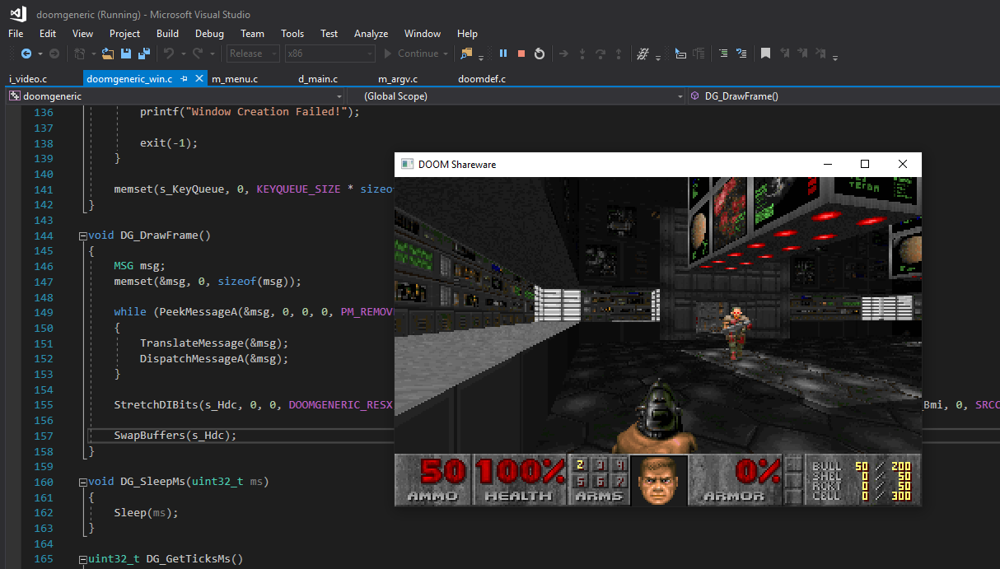
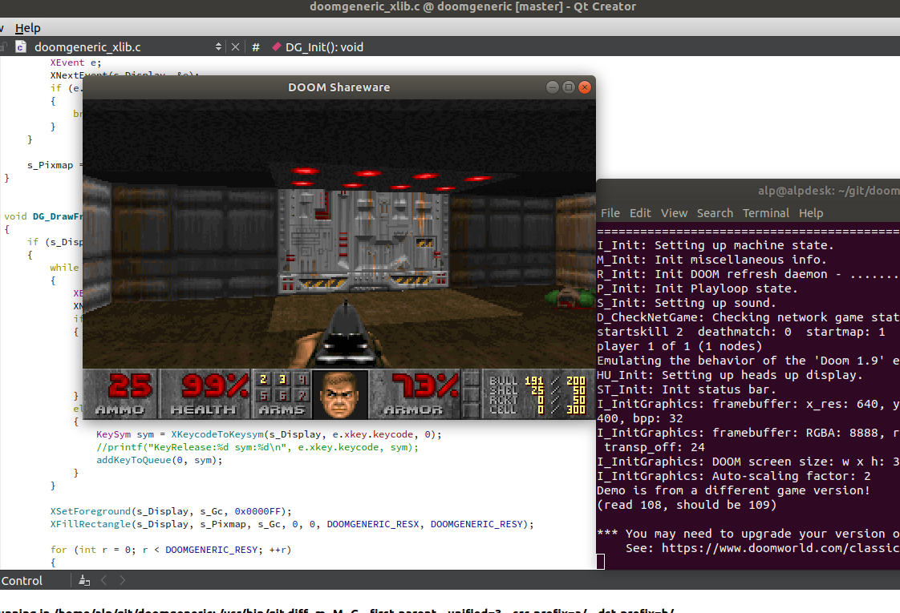
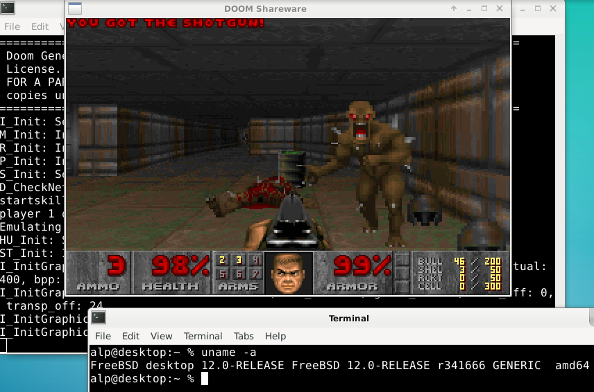
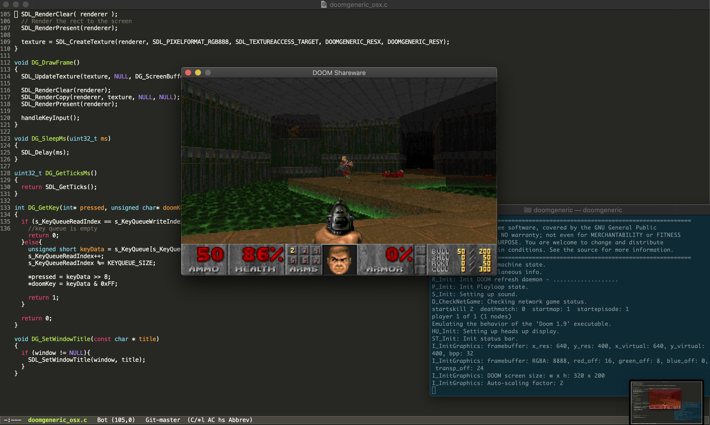

Apr 2024 FL
-----------------------------------------
doom -playdemo demo1
doom -timedemo demo1
doom -timedemo demo1 -offset 10 10

doom -offset 0 0 -playdemo demo1 &
doom -offset 700 0 -playdemo demo2  &

-iwad for a specified wad (otherwise gothrough the built in list of "iwads")

-----------------------------------------

to build, put this dir under $(vos_repo)/usr/

cf makeall.sh on rebuilding & packing sd.bin

# command args
https://doom.fandom.com/wiki/Parameter

# play demo (recorded *.lmp files, can be downllaoded from Internet; or built-in demo1 demo2 demo3)
https://doom.fandom.com/wiki/Parameter#-playdemo

doom -playdemo <lump>
doom -playdemo demo1

play demo code path. 
D_DoomMain -> ... 
then G_DoPlayDemo()


# replay ASAP, show fps at the end
doom -timedemo demo1
-----------------------------------------
how the prograwm locates iwad files
list of wads to check: 
cf d_iwad.c
the search path, cf BuildIWADDirList()
AddIWADDir (...) 
Or, can change config.h 
#define FILES_DIR "."

SearchDirectoryForIWAD()
will get through all wads in the list, and try to open them.
in the list of iwads[]
-----------------------------------------

chekc args:
M_CheckParmWithArgs()

-----------------------------------------

for our kernel, most changes: 
- doomgeneric_minisdl.c (minisdl interface)
- makefile etc
-----------------------------------------
sdl sound apis used in i_sdlmusic: 
SDL_Init(SDL_INIT_AUDIO)...
SDL_QuitSubSystem(SDL_INIT_AUDIO);

SDL_PauseAudio
SDL_QuitSubSystem

SDL_LockAudio()
SDL_UnlockAudio()


sdl mixer apis
Mix_SetPanning
Mix_UnregisterAllEffects
Mix_PlayChannelTimed
Mix_Playing

-----------------------------------------
(notes to self)

git repo: 
https://github.com/fxlin/doomgeneric
https://github.com/ozkl/doomgeneric.git

removed .git/ for lab5 (to avoid confusing "git rev-parse --show-toplevel"

game files also problematic:... mujltiple instances will do "seek" on same file, messed up

Using ./.savegame/ for savegames >>> alsl problem
Using . for configuration and saves
saving config in .default.cfg >>>> could this cause problem? for multi games?

code: D_AdvanceDemo()  --- play the setquence of demos (automatically??)
G_CheckDemoStatus()  called when demo exits. 
    gets called, but defdemoname is bad??


-----------------------------------------

(original readme.md below)

# doomgeneric
The purpose of doomgeneric is to make porting Doom easier.
Of course Doom is already portable but with doomgeneric it is possible with just a few functions.

To try it you will need a WAD file (game data). If you don't own the game, shareware version is freely available (doom1.wad).

# porting
Create a file named doomgeneric_yourplatform.c and just implement these functions to suit your platform.
* DG_Init
* DG_DrawFrame
* DG_SleepMs
* DG_GetTicksMs
* DG_GetKey

|Functions            |Description|
|---------------------|-----------|
|DG_Init              |Initialize your platfrom (create window, framebuffer, etc...).
|DG_DrawFrame         |Frame is ready in DG_ScreenBuffer. Copy it to your platform's screen.
|DG_SleepMs           |Sleep in milliseconds.
|DG_GetTicksMs        |The ticks passed since launch in milliseconds.
|DG_GetKey            |Provide keyboard events.
|DG_SetWindowTitle    |Not required. This is for setting the window title as Doom sets this from WAD file.

### main loop
At start, call doomgeneric_Create().

In a loop, call doomgeneric_Tick().

In simplest form:
```
int main(int argc, char **argv)
{
    doomgeneric_Create(argc, argv);

    while (1)
    {
        doomgeneric_Tick();
    }
    
    return 0;
}
```

# sound
Sound is much harder to implement! If you need sound, take a look at SDL port. It fully supports sound and music! Where to start? Define FEATURE_SOUND, assign DG_sound_module and DG_music_module.

# platforms
Ported platforms include Windows, X11, SDL, emscripten. Just look at (doomgeneric_win.c, doomgeneric_xlib.c, doomgeneric_sdl.c).
Makefiles provided for each platform.

## emscripten
You can try it directly here:
https://ozkl.github.io/doomgeneric/

emscripten port is based on SDL port, so it supports sound and music! For music, timidity backend is used.

## Windows


## X11 - Ubuntu


## X11 - FreeBSD


## SDL

